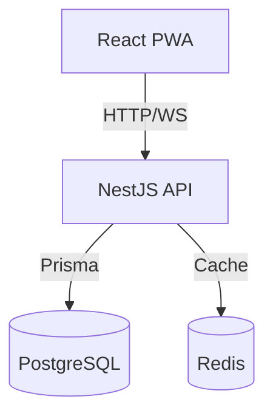

# 🎨 CraftFlow - Sistema de Gestión para Artesanos

> Sistema completo de planificación y gestión de proyectos artesanales, diseñado para ayudar a pequeños productores a evitar sobrecarga y cumplir con plazos de entrega.

<!-- [](https://github.com/dperalta86/craftflow/actions) -->
[](https://codecov.io/gh/dperalta86/craftflow)
[](https://www.gnu.org/licenses/gpl-3.0.html)

[🚀 Demo en vivo](https://craftflow-demo.vercel.app) | [📖 Documentación](https://github.com/dperalta86/craftflow/wiki) | [🎯 Roadmap](https://github.com/users/dperalta86/projects/1)

---

## 📋 Tabla de Contenidos

- [Acerca del Proyecto](#-acerca-del-proyecto)
- [Problema que Resuelve](#-problema-que-resuelve)
- [Características Principales](#-características-principales)
- [Stack Tecnológico](#-stack-tecnológico)
- [Arquitectura](#-arquitectura)
- [Instalación](#-instalación)
- [Uso](#-uso)
- [Roadmap](#-roadmap)
- [Casos de Uso Reales](#-casos-de-uso-reales)
- [Contribuir](#-contribuir)

---

## 🎯 Acerca del Proyecto

CraftFlow es un sistema de planificación y gestión de pedidos orientado a emprendimientos artesanales que producen bajo pedido.
El sistema permite organizar pedidos por etapas, controlar la capacidad productiva y prevenir atrasos mediante planificación visual y alertas.

El proyecto fue desarrollado siguiendo el ciclo completo de un sistema de información: análisis, diseño, implementación, pruebas y despliegue.

Este sistema ayuda a:
- Estimar tiempos de producción realistas
- Visualizar la carga de trabajo actual
- Alertar cuando se está llegando al límite de capacidad
- Gestionar el estado de cada pedido en tiempo real

### 🎥 Demo en Video

[](https://www.youtube.com/watch?v=VIDEO_ID)

---

## 🔍 Problema que Resuelve

### El Problema

Muchos emprendimientos artesanales gestionan pedidos mediante agendas informales, mensajes y recordatorios aislados, lo que genera:

- ❌ Falta de visibilidad sobre la carga de trabajo
- ❌ Dificultad para planificar por etapas
- ❌ Riesgo de incumplir fechas de entrega
- ❌ Problemas para decidir si aceptar nuevos pedidos

### La Solución

CraftFlow proporciona:
- ✅ **Estimación inteligente** de tiempos basada en proyectos anteriores
- ✅ **Alertas tempranas** cuando se acerca el límite de capacidad
- ✅ **Calendario visual** de compromisos
- ✅ **Dashboard de estado** en tiempo real
- ✅ **Notificaciones automáticas** de desvíos


CraftFlow aborda estos problemas mediante un enfoque de planificación productiva simple e intuitivo.

---

## ✨ Características Principales

### Para Artesanos
- 📊 **Dashboard intuitivo** con vista general de todos los proyectos
- ⏱️ **Estimación automática** de tiempos de producción
- 🔔 **Sistema de alertas** para desvíos de cronograma
- 📅 **Calendario de entregas** con código de colores
- 📈 **Estadísticas** de productividad y cumplimiento

### Técnicas
- 🔐 **Autenticación JWT** con refresh tokens
- 📱 **Progressive Web App** (funciona offline)
- 🎨 **UI responsive** (mobile-first)
- 🔄 **Real-time updates** con WebSockets
- 🧪 **Cobertura de tests** > 80%
- 🐳 **Dockerizado** para fácil deployment
- 📚 **API REST** completamente documentada (Swagger)

---

## 🛠️ Stack Tecnológico

### Backend
- **Runtime:** Node.js 20 LTS
- **Framework:** NestJS 10
- **Lenguaje:** TypeScript 5
- **ORM:** Prisma 5
- **Base de datos:** PostgreSQL 16
- **Auth:** JWT + bcrypt
- **Validación:** class-validator
- **Testing:** Jest

### Frontend
- **Framework:** React 18
- **Lenguaje:** TypeScript 5
- **Build tool:** Vite 5
- **Styling:** TailwindCSS 3
- **State management:** Zustand
- **HTTP Client:** Axios
- **UI Components:** Radix UI
- **Forms:** React Hook Form + Zod
- **Testing:** Vitest + React Testing Library

### DevOps & Tools
- **Containerización:** Docker + Docker Compose
- **CI/CD:** GitHub Actions
- **Code Quality:** ESLint + Prettier + Husky
- **Análisis estático:** SonarCloud
- **Deployment:** Railway (backend) + Vercel (frontend)
- **Monitoring:** Sentry

---

## 🏗️ Arquitectura

### Diagrama de Alto Nivel



### Estructura del Proyecto

```
craftflow/
├── backend/
│   ├── src/
│   │   ├── modules/
│   │   │   ├── auth/
│   │   │   ├── users/
│   │   │   ├── projects/
│   │   │   ├── tasks/
│   │   │   └── notifications/
│   │   ├── common/
│   │   ├── config/
│   │   └── database/
│   ├── prisma/
│   ├── test/
│   └── Dockerfile
├── frontend/
│   ├── src/
│   │   ├── components/
│   │   ├── pages/
│   │   ├── hooks/
│   │   ├── services/
│   │   ├── stores/
│   │   └── utils/
│   ├── public/
│   └── Dockerfile
└── docs/
    ├── architecture/
    ├── api/
    └── user-stories/
```

Ver [documentación completa de arquitectura](./docs/architecture/README.md)

---

## 🚀 Instalación

### Prerrequisitos

- Node.js >= 20
- PostgreSQL >= 16
- pnpm (recomendado) o npm
- Docker (opcional)

### Instalación Local

1. **Clonar el repositorio**
   ```bash
   git clone https://github.com/dperalta86/CraftFlow.git
   cd CraftFlow
   ```

2. **Backend Setup**
   ```bash
   cd backend
   pnpm install
   
   # Configurar variables de entorno
   cp .env.example .env
   # Editar .env con tus credenciales
   
   # Ejecutar migraciones
   pnpm prisma migrate dev
   
   # Seed de datos (opcional)
   pnpm prisma db seed
   
   # Iniciar en desarrollo
   pnpm run start:dev
   ```

3. **Frontend Setup**
   ```bash
   cd frontend
   pnpm install
   
   # Configurar variables de entorno
   cp .env.example .env
   
   # Iniciar en desarrollo
   pnpm run dev
   ```

### Con Docker

```bash
# En la raíz del proyecto
docker-compose up -d

# La app estará disponible en:
# Frontend: http://localhost:5173
# Backend: http://localhost:3000
# Swagger: http://localhost:3000/api/docs
```

---

## 📖 Uso

### Primeros Pasos

1. **Registrarse** como artesano
2. **Crear tu primer proyecto** con descripción y fecha de entrega
3. **Dividir en tareas** con estimaciones de tiempo
4. **Actualizar el estado** de las tareas según avanzás
5. **Recibir alertas** si te estás retrasando

### Capturas de Pantalla

#### Dashboard Principal


#### Creación de Proyecto


#### Vista de Calendario


---

## 🗺️ Roadmap

### ✅ Fase 1 - MVP (Completado)
- [x] Autenticación de usuarios
- [x] CRUD de proyectos y tareas
- [x] Dashboard básico
- [x] Estimación de tiempos
- [x] Sistema de alertas

### 🚧 Fase 2 - En Progreso
- [ ] WebSockets para updates en tiempo real
- [ ] Modo offline (PWA)
- [ ] Export de reportes PDF
- [ ] Integración con calendario (Google Calendar)

### 🔮 Fase 3 - Planificado
- [ ] Gestión de clientes
- [ ] Cotizaciones automáticas
- [ ] Múltiples artesanos (equipos)
- [ ] Mobile app nativa (React Native)

Ver [roadmap completo](https://github.com/users/tuusuario/projects/1)

---

## 📊 Casos de Uso Reales

El diseño y validación del sistema se realizaron utilizando como caso de estudio un emprendimiento de producción de cookies artesanales para eventos y cumpleaños.

El sistema, sin embargo, fue diseñado de forma genérica para adaptarse a distintos tipos de producción artesanal.

## 🤝 Contribuir

¡Las contribuciones son bienvenidas! Por favor lee [CONTRIBUTING.md](./CONTRIBUTING.md) para detalles sobre el proceso.

### Pasos para Contribuir

1. Fork el proyecto
2. Crea tu Feature Branch (`git checkout -b feature/AmazingFeature`)
3. Commit tus cambios (`git commit -m 'Add some AmazingFeature'`)
4. Push a la Branch (`git push origin feature/AmazingFeature`)
5. Abre un Pull Request

---

⭐ Si este proyecto te resultó útil, por favor dale una estrella en GitHub!